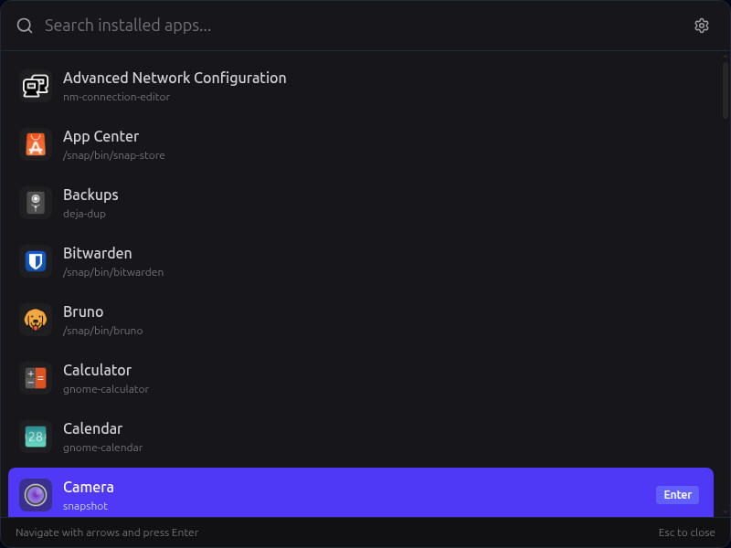
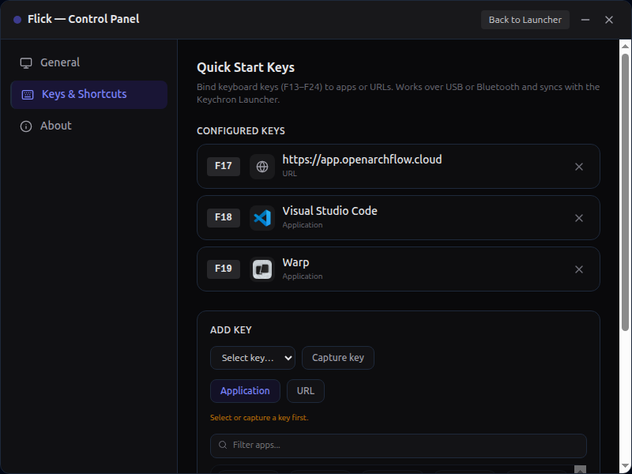
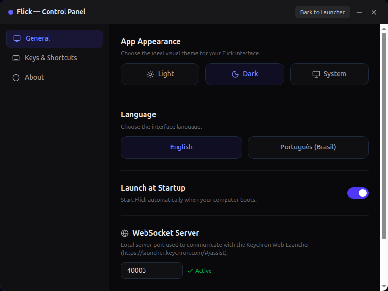

# Flick Launcher

<div align="center">
  
  
  <h3>A lightweight, high-performance, and custom-styled keyboard shortcut manager and app launcher for Linux.</h3>
  
  <p>Built with Tauri v2, Rust, React, TypeScript, and Tailwind CSS.</p>
  
  <p>
    <a href="https://github.com/dmux/flick-rust">
      
    </a>
  </p>
</div>

---

## Features

- **Blazing Fast Launcher**: A responsive, frameless window to search and launch installed desktop applications instantly.
- **Draggable Window**: Interactive window title bars and search headers that support drag-to-move using native Tauri drag regions (`data-tauri-drag-region`).
- **GSettings Synchronization**: Automatically synchronizes keyboard shortcuts and custom hotkeys with the Linux OS GSettings backend.
- **WebSocket Compatibility Server**: Built-in backend WebSocket server compatible with the Keychron Launcher web application to map and manage keys.
- **HID Listener**: Listens to custom input events to handle quick launch tasks dynamically.
- **Premium UI/UX**: Sleek dark/light theme support, glassmorphism elements, neon highlights, and seamless animations.

---

## Screenshots

### Instant Launcher

Summon the Spotlight-style command palette from a key and fuzzy-search any installed app, with arrow-key navigation and real application icons.

<div align="center">
  
</div>

### Quick Start Key Bindings

Bind keys (F13–F24) to apps or URLs from the **Keys & Shortcuts** panel — over USB **or** Bluetooth, with two-way sync to the Keychron Launcher.

<div align="center">
  
</div>

### Settings

Pick a theme and language, toggle launch-at-startup, and configure the WebSocket bridge from the **General** panel.

<div align="center">
  
</div>

---

## Technical Stack

- **Backend**: Rust, `tauri` (v2), `tokio` (for async runtime tasks), `gsettings` APIs.
- **Frontend**: React (v18), TypeScript, Vite, Tailwind CSS (v4), Lucide React.
- **Packaging**: Built-in support for generating `.deb` and `.rpm` installers natively.

---

## Getting Started

### Prerequisites

Ensure you have Rust, Node.js (v18+), and `pnpm` installed on your system. You will also need standard build tools for Linux:

```bash
sudo apt-get install -y libgtk-3-dev libwebkit2gtk-4.1-dev build-essential curl wget libssl-dev libayatana-appindicator3-dev librsvg2-dev
```

### Installation

1. Clone the repository and navigate into the `flick-rust` directory:
   ```bash
   cd flick-rust
   ```

2. Install the frontend dependencies:
   ```bash
   pnpm install
   ```

### Development

To start the application in development mode with hot-reloading:

```bash
pnpm tauri dev
```

This runs Vite on `http://localhost:1420` and opens the native Tauri window.

### Production Build

To compile the application in release mode and package it:

```bash
pnpm tauri build
```

The compiled binaries and packages (`.deb`, `.rpm`) will be generated inside the `src-tauri/target/release/bundle/` directory.

---

## Native Window Dragging

The window is configured without native borders (`decorations: false`). Moving the window is done via the HTML attribute:
* `data-tauri-drag-region` on the search input header in Launcher view.
* `data-tauri-drag-region` on the custom title bar in Settings view.

This invokes the OS window manager to handle window positioning smoothly without custom JS calculation loops.

---

## GitHub Actions & CI/CD

The project includes pre-configured GitHub Actions workflows inside `.github/workflows/`:

1. **Test (`test.yml`)**: Triggered on every push and pull request. Automates code formatting, type checking, and executes `cargo check` on the Rust codebase to prevent build failures.
2. **Build & Package (`build.yml`)**: Triggered manually (`workflow_dispatch`). Automates building and packaging the application for Windows, macOS, and Linux. Supports creating draft GitHub Releases with the generated installation binaries.
